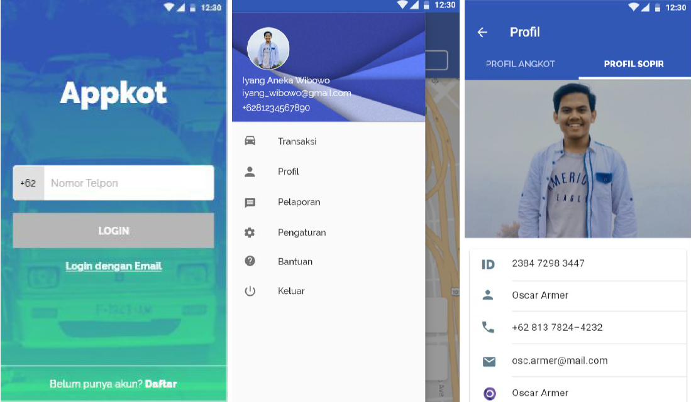
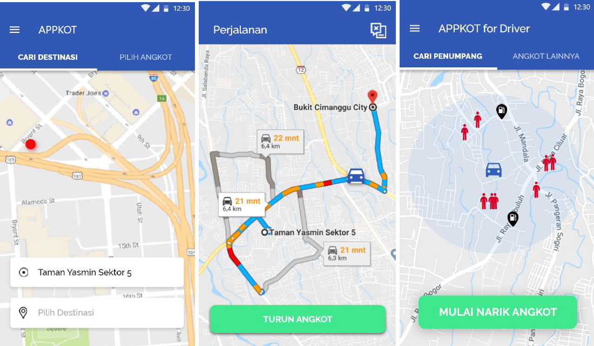

# **AppKot, Aplikasi Angkot Online Berbasis Mobile Untuk Memperbaiki Sistem Angkutan Umum di Indonesia**

## **BAB 1. PENDAHULUAN**

**1.1. Latar Belakang Masalah**

Angkutan kota atau biasa disebut dengan angkot, merupakan sarana transportasi yang sudah tidak asing lagi bagi sebagian besar masyarakat di Indonesia. Angkutan kota disediakan untuk mengangkut penumpang menuju tujuan tertentu sesuai trayek yang telah ditetapkan. Angkutan kota ini masih dirasa penting keberadaannya oleh sebagian masyarakat, khususnya masyarakat yang berpenghasilan menengah ke bawah, karena dengan tarif sekali angkut yang relatif murah dan kemudahan menemukan angkot dimanapun dan kapanpun membuat angkot masih dijadikan sebagai transportasi umum yang digunakan sehari-hari.

Dewasa ini, angkutan kota semakin ditinggalkan oleh sebagian masyarakat akibat infrastruktur dan fasilitas yang kurang memadai, serta kurangnya inovasi dan perawatan pada kendaraan yang digunakan. Juga sopir angkot yang sering semena-mena dalam mengendarai angkot, terbukti dari banyaknya kecelakaan, pelanggaran lalu lintas, dan kemacetan yang diakibatkan oleh angkot. Penurunan jumlah pengguna angkutan kota yang cukup besar terjadi di beberapa kota besar, salah satunya di Kota Bogor. Hal ini dapat dilihat dengan semakin banyaknya angkot yang mengangkut sedikit penumpang.

Selain itu, salah satu faktor yang juga menjadi penyebab turunnya minat masyarakat pada angkutan kota, yaitu sudah banyaknya transportasi umum alternatif yang menawarkan infrastruktur dan fasilitas yang jauh lebih baik dibanding angkutan kota. Perusahaan transportasi online seperti Go-Jek, Grab, dan Uber mampu dengan cepat mengambil pasar dalam pertransportasian umum di Indonesia. Masyarakat dengan cepat mampu mengubah kebiasaan mereka dari menggunakan angkutan kota ke transportasi online, karena dengan didukung teknologi yang mampu mempermudah dan meningkatkan pelayanan yang ditawarkan.

Saat ini teknologi memegang peranan penting dalam mempermudah aktivitas sehari-hari manusia. Pesatnya perkembangan Ilmu Pengetahuan dan Teknologi (IPTEK) membuat manusia terus-menerus melakukan penelitian dan pengkajian terhadap isu-isu yang sedang berkembang. Peran teknologi informasi menitikberatkan pada pengaturan sistem informasi, selain itu teknologi informasi dapat memenuhi kebutuhan organisasi dengan sangat cepat, tepat waktu, relevan, dan akurat (Ismanto, 2010).

Berkembangnya teknologi informasi memberikan banyak manfaat bagi kehidupan manusia. Seperti kemudahan bagi setiap orang untuk mengakses informasi-informasi yang ada di internet, meningkatkan output dari pekerjaan yang dilakukan, serta mampu meningkatkan efektivitas dan efisiensi kerja suatu organisasi. Oleh karena itu, sebelum mengimplementasikannya, sebaiknya pengembang sistem memiliki pemahaman mengenai faktor-faktor yang dapat mempengaruhi perilaku pemakai dalam memanfaatkan TI (Darmini, 2009).

**1.2. Perumusan Masalah**

Adapun permasalahan yang menjadi latar belakang proposal ini adalah:

1. Kurang tertibnya angkot ketika beroperasi di jalanan sehingga menyebabkan kemacetan.
2. Tarif angkot tidak standar dan berubah-ubah sehingga membingungkan penumpang.
3. Sulit membedakan pejalan kaki yang ingin naik angkot dengan yang tidak ingin naik.
4. Sulit melaporkan sopir atau penumpang yang melanggar tata tertib transportasi umum sehingga pelanggaran semakin marak.
5. Penumpang yang tidak hafal rute-rute angkot bisa kesulitan menentukan angkot yang akan ditumpangi.

**1.3. Tujuan Program**

Dalam membuat teknologi ini diharapkan dapat bermanfaat untuk:

1. Memudahkan pengguna dalam melaporkan tindak pelanggaran yang terjadi ketika menggunakan jasa angkot.
2. Memudahkan supir angkot untuk menemukan penumpang, dan penumpang dalam menentukan angkot yang ingin ditumpangi.
3. Menyediakan informasi rute dan tarif angkot.

**1.4. Luaran yang Diharapkan**

Adapun luaran yang diharapkan dengan berjalannya program ini yaitu:

1. Terciptanya sarana untuk melaporkan pelanggaran yang dilakukan oleh sopir atau penumpang angkot.
2. Terciptanya fitur untuk melihat rute angkot, melihat tarif angkot, melihat penumpang yang akan naik, dan memilih angkot untuk ditumpangi.

**1.5. Manfaat Kegiatan**

Adapun manfaat dari kegiatan ini adalah:

1. Mengurangi kemacetan dengan membuat operasi angkot lebih tertib.
2. Mengurangi tingkat pelanggaran yang terjadi di dalam transportasi angkot.
3. Meningkatkan minat masyarakat untuk menggunakan transportasi angkot.

## **BAB 2. TINJAUAN PUSTAKA**

**2.1 Angkutan Kota**

Angkutan kota atau yang biasa disingkat &quot;angkot&quot; adalah sebuah transportasi umum dengan rute yang telah ditentukan. Tidak seperti bus yang mempunyai halte sebagai tempat berhenti, angkot dapat berhenti untuk menaikkan dan menurunkan penumpang dimana saja. Jenis kendaraan yang digunakan adalah minibus atau bus kecil.

**2.2 Angkot dan Kemacetan**

 Kapolresta Bogor Kota, Polda Jawa Barat, AKBP Suyudi Ario Seto mengatakan, ada delapan permasalahan yang menyebabkan kemacetan yang perlu diantisipasi pada libur Natal dan Tahun Baru 2017, salah satunya adalah “naik turun penumpang oleh supir angkutan umum, pasar tumpah seperti di Pasar Bogor, Jl Merdeka, dan MA Salmun” (ANTARA News). 

Ledakan penggunaan kendaraan pribadi yang menyebabkan kemacetan semakin parah. Hal ini tentu dipicu oleh efektivitas waktu jika memakai kendaraan pribadi dan angkutan umum yang tidak menawarkan jasa yang memadai (Kompas).

**2.3 Minat Masyarakat terhadap Angkutan Umum**

Perekonomian yang tengah lesu membuat masyarakat malas menggunakan transportasi umum, terutama angkot, taksi, dan bus. &quot;Perekonomian kita turun, daya beli masyarakat turun sehingga mempengaruhi semua sektor. Kalau angkutan umum, persentase penggunaannya mengalami penurunan drastis hingga 30 persen lebih. Itu sudah sejak 3-4 bulan yang lalu,&quot; kata Shafruhan kepada Kompas.com, Kamis (8/10/2015) (Kompas).

## **BAB 3. METODE PELAKSANAAN**

**3.1 Alat dan Bahan**

1. Sistem Operasi Android
2. Sistem Operasi Windows
3. Adobe XD
4. Adobe Photoshop

**3.2 Perumusan Ide Rancangan**

Metode yang digunakan dalam aplikasi ini adalah dengan menggunakan pendekatan rancangan prototipe. Proses pengembangan sistem seringkali menggunakan pendekatan prototipe prototyping. Metode ini sangat baik digunakan untuk menyelesaikan masalah kesalahpahaman antara pengguna dan analis yang timbul akibat pengguna tidak mampu mendefinisikan secara jelas kebutuhannya (Mulyanto, 2009).

Prototyping adalah pengembangan yang cepat dan pengujian terhadap model kerja prototype dari aplikasi baru melalui proses interaksi dan berulang-ulang yang biasa digunakan ahli sistem informasi dan ahli bisnis. _Prototyping_ disebut juga desain aplikasi cepat rapid application design karena menyederhanakan dan mempercepat desain sistem (O&#39;brien, 2005).

Sebagian pengguna kesulitan mengungkapkan keinginannya untuk mendapatkan aplikasi yang sesuai dengan kebutuhannya. Kesulitan ini yang perlu diselesaikan oleh analis dengan memahami kebutuhan pengguna dan menerjemahkannya ke dalam bentuk model prototype. Model ini selanjutnya diperbaiki secara terus menerus sampai sesuai dengan kebutuhan pengguna.

 

  

Gambar 3.21 (Diagram Model Prototype)

**3.3 Rencana Pengembangan**

Rencana pengembangan aplikasi AppKot ini terbagi menjadi lima tahap, yaitu:

1. Identifikasi Masalah

   
Pada tahap ini kami mengidentifikasi masalah yang dimiliki oleh pengguna. Tujuan identifikasi masalah ini adalah untuk mengetahui masalah yang dialami oleh pengguna sehingga masalah tersebut dapat diatasi melalui sistem informasi kami. Dengan menggunakan Empathy Map kami peroleh permasalahan berikut:

  

Gambar 3.31 (Empathy Map)

2. Perancangan Sistem

Tujuan perancangan sistem ini adalah agar pengembang dapat menyelesaikan masalah yang dimiliki oleh klien. Dengan menggunakan Experience Map diperoleh perancangan sistem dilihat dari sebelum, saat, dan setelah adanya aplikasi AppKot:

3. Experience Map

   

     
   

   
Gambar 3.32 Experience map penumpang dan sopir angkot

4. Evaluasi Sistem

Pada tahap ini, sistem informasi telah diimplementasikan ke dalam bentuk aplikasi. Sistem informasi tersebut akan dievaluasi untuk mengetahui kesalahan yang dimiliki oleh sistem. Kemudian akan dilakukan perbaikan terhadap kesalahan yang ada. Evaluasi aplikasi diketahui berdasarkan hasil ulasan dari klien, dan error-checking terhadap sistem.

5. Sosialisasi

Tahap yang terakhir adalah sosialisasi. Pada tahap ini kami akan memperkenalkan sistem informasi beserta cara pemakaian sistem yang akan digunakan oleh klien. Dengan sosialisasi, kendala yang dialami oleh pengguna dapat diminimalisir.

## **BAB 4. ANALISIS PENGGUNA**

##### 4.1 Target Pengguna

  

Gambar 3.41 User persona penumpang angkot

##### 4.2 Batasan Produk

Adapun batasan produk dari aplikasi yang kami buat diantaranya:
1. Appkot hanya berlaku untuk kota Bogor
2. Tarif angkot jauh dekat sama, namun tiap angkot bisa berbeda tarif
3. Satu angkot hanya untuk satu supir

##### 4.3 Skenario Pengguna

Skenario penumpang angkot yaitu:

1. Penumpang mendaftar ke aplikasi Appkot. Penumpang kemudian login untuk memulai memakai.
2. Penumpang dapat menentukan destinasi untuk mengetahui angkot mana saja yang dinaiki. Penumpang memilih tempat tujuan kemudian penumpang mendapatkan rekomendasi angkot serta tarifnya, kemudian penumpang memilih angkot yang diinginkan.
3. Penumpang juga dapat memilih langsung angkot yang mau dinaiki. Penumpang tinggal memilih angkot.
4. Setelah memilih angkot, penumpang akan menunggu hingga angkot datang kemudian penumpang menekan tombol “naik angkot”.
5. Berbeda dengan sistem biasanya, penumpang membayar angkot di awal. Pembayaran secara default menggunakan pembayaran digital. Ketika transaksi berhasil, pengemudi mendapat notifikasi pembayaran dan penumpang dapat naik. Jika gagal, penumpang harus membayar langsung.
6. Ketika di angkot, penumpang dapat melaporkan jika pengemudi melakukan hal-hal yang salah. Penumpang tinggal menekan tombol di pojok kanan atas dan mengisi form yang muncul.
7. Ketika penumpang turun, penumpang tinggal menekan tombol turun angkot dan selesai.
8. Penumpang juga dapat melihat informasi angkot yang ada dan trayeknya, melihat riwayat pelaporan angkot, riwayat naik angkot, dan mengganti profil.

Skenario sopir angkot yaitu:

1. Sopir melakukan login menggunakan akun yang telah didaftarkan sebelumnya melalui lembaga DLLAJ,
2. Jika login berhasil, aplikasi akan meminta permission untuk mengakses lokasi sopir saat ini,
3. Jika sopir memberikan akses lokasi, maka sopir akan dihadapkan oleh tampilan awal yaitu “Cari Penumpang”, berisikan informasi tentang lokasi sopir saat ini, posisi penumpang yang berada pada radius sekitar 100 - 200 meter. Selain “Cari Penumpang”, pada menu utama terdapat pilihan “Angkot Lainnya” yang dapat menampilkan angkot terdekat yang sedang beroperasi,
4. Ketika sopir ingin mulai menarik angkot, sopir harus menekan tombol “Mulai Narik Angkot” lalu akan muncul pop up tentang term and condition penarikan angkot, dengan memilih “Ya” artinya sopir telah
setuju dan siap untuk narik angkot,
5. Jika telah selesai, maka sopir menekan tombol “Selesai Narik Angkot” kemudian pilih “Ya” pada pop up yang muncul,
6. Apabila terdapat laporan masuk dari penumpang, sopir dapat memeriksanya pada pilihan menu “Pelaporan” yang berisikan informasi berupa waktu pelaporan dan isi keluhan,
7. Apabila ingin melihat rincian transaksi pemasukan dan pengeluaran, sopir dapat memeriksanya pada pilihan menu “Transaksi” yang berisikan informasi berupa waktu transaksi dan jenis pengeluaran / pemasukan. Transaksi dapat diurutkan berdasarkan waktu transaksi.
8. Sopir mampu melihat profil angkot dan profil diri pada pilihan menu “Profil”. Informasi profil sopir yang dapat diubah hanya pada bagian password.

## BAB 5. HASIL DAN PEMBAHASAN

##### 5.1 Prototipe Aplikasi

  

  

##### 5.2 Pengujian

1. Deskripsi Pengujian

  Pengujian dilakukan menggunakan metode Think-Aloud Usability Testing

2. Pelaksanaan Pengujian
  Pengujian dilakukan untuk dua role , yaitu role untuk penumpang dan pengemudi.

  Pengujian untuk role pengemudi dilakukan tanggal 30 November 2018 dengan dua responden:

  a. Responden 1
  Nama: Ridwan M Nugraha
  Umur: 20
  Pekerjaan: Mahasiswa Fakultas Perikanan
  Pengalaman: Pengendara Mobil

  b. Responden 2
  Nama: Made Khrisna Yoga
  Umur: 20
  Pekerjaan: Mahasiswa Fakultas Kehutanan
  Pengalaman: Pengendara Bis

  Berikut hasil pengujian prototipe AppKot untuk sopir angkot:

  | **No** | **Task**            | **Responden 1**                                              | **Responden 2**                                              |
  | ------ | ------------------- | ------------------------------------------------------------ | ------------------------------------------------------------ |
  | **1**  | **Login**           | Transisi dari login ke home kurang menarik                   | Ada *allow permission* untuk meminta akses lokasi Simpel, karena user hanya memerlukan nomor handphone |
  | **2**  | **Narik Angkot**    | Cakupan radius sudah cukup Dialog / pop up informasi tidak terlalu penting Peta perlu ada info penting seperti daerah macet dan tempat penting seperti pom bensin | Tombol “Mulai Narik” udah pas Antara “Cari Penumpang” dan “Angkot Terdekat” menu-selectednya diganti jadi underline dan warnanya jgn sama dengan warna background untuk meminimalisir mispersepsi  Maps nya dibikin simpel, seperti cuma nampilin nama-nama jalan besar Titik merah diganti  jadi icon orang Radius dibuat sekitar 100-200 meter *Pop up* ditambahkan icon *warning* Icon angkot terdekat diganti jadi panah Angkot terdekat tidak perlu menggunakan radius Tambahkan *unique places* di map nya |
  | **3**  | **Lihat Profil**    | Lebih *prefer* icon profil yang bisa diklik Buat tarif berbeda tergantung pada jarak Tambah nomor identitas supir Sudah *user friendly* banget | Lebih *prefer* tulisan “Profil” yang bisa diklik Tarif disesuaikan berdasarkan jarak Masukin ID / nomor seri trayek Profil supir tambahin No KTP, SIM Tampilan UI udah bagus |
  | **4**  | **Lihat Transaksi** | Bisa juga tambahkan info penumpang naik dan turun dimana Tidak suka tampilan tanggal, lebih baik tampilan yang di scroll Tampilan sudah bagus | Tarif untuk bayar langsung lebih baik ditampilkan  info nominalnya Ada rekapitulasi pemasukan dan pengeluaran uang Tampilan sudah bagus |
  | **5**  | **Lihat Pelaporan** | Tampilan simpel dan informasi sudah rinci                    | Tampilan simpel dan informasi sudah rinci                    |

  Pengujian untuk role penumpang dilakukan tanggal 2 Desember 2018 dengan dua responden:
  a. Responden 1 :
  Nama : Fajar Prastya
  Umur : 20
  Pekerjaan : Mahasiswa

  b. Responden 2 :
  Nama : Yogi Dwi Siswanto
  Umur: 20
  Pekerjaan: Mahasiswa

  Berikut hasil pengujian prototipe AppKot untuk penumpang angkot:

  | **No** | **Task**                       | **Responden 1**                                              | **Responden 2**                                              |
  | ------ | ------------------------------ | ------------------------------------------------------------ | ------------------------------------------------------------ |
  | **1**  | **Login**                      | Mudah, karena user hanya perlu menggunakan nomor handphone   | Tidak ada kendala                                            |
  | **2**  | **Pilih Destinasi**            | Mudah karena ada map destinasi                               | Mudah Digunakan Tampilan sudah sesuai Untuk rute jauh sebaiknya ada opsi pindah angkot |
  | **3**  | **Pilih angkot**               | Mudah untuk dipahami                                         | Langsung dipahami                                            |
  | **4**  | **Naik Angkot dan Lapor**      | Fitur lapor: bisa mengurangi masalah yang selama ini sering terjadi di angkot seperti ngetem yang lama, pengamen yang turun naik-angkot dsb. | Responden langsung paham menggunakan fitur lapor             |
  | **5**  | **Turun Angkot dan Pelaporan** | Mudah digunakan                                              | Responden senang karena bisa menggunakan pembayaran OVO, banyak promo |

## **BAB 6. PERAN PENGEMBANG DAN JADWAL KEGIATAN**

**6.1 Peran Pengembang**

Tabel 6.1 Peran Pengembang

| **No** | **Nama**                | **Peran**                           |
| ------ | ----------------------- | ----------------------------------- |
| 1.     | Rafiqah Hasna Sukma     | Perancang Prototipe Untuk Sopir     |
| 2.     | Iyang Aneka Wibowo      | Perancang Prototipe Untuk Sopir     |
| 3.     | Maya Maharani Krismanti | Perancang Prototipe Untuk Penumpang |
| 4.     | M. Idzhar Darissalam    | Perancang Prototipe Untuk Penumpang |

##### **6.2 Jadwal Kegiatan**

Tabel 6.2 Jadwal Kegiatan

| No   | Kegiatan                                              |      |      | M    | I    | N    | G    | G    | U    |      |      |
| ---- | ----------------------------------------------------- | ---- | ---- | ---- | ---- | ---- | ---- | ---- | ---- | ---- | ---- |
|      |                                                       | 3    | 4    | 5    | 6    | 7    | 8    | 9    | 10   | 11   | 12   |
| 1.   | Identifikasi permasalahan                             | ✓    | ✓    |      |      |      |      |      |      |      |      |
| 2.   | Merumuskan ide rancangan fungsional dan gambar teknik |      |      | ✓    | ✓    |      |      |      |      |      |      |
| 3.   | Merumuskan dan menyempurna-kan rancangan struktural   |      |      | ✓    | ✓    |      |      |      |      |      |      |
| 4.   | Konsultasi rancangan                                  |      |      | ✓    | ✓    | ✓    |      |      |      |      |      |
| 5.   | Pemilihan alat dan bahan yang cocok                   |      |      |      | ✓    | ✓    |      |      |      |      |      |
| 6.   | Pembuatan alat                                        |      |      |      |      |      | ✓    |      |      |      |      |
| 7.   | Uji coba alat                                         |      |      |      |      |      |      | ✓    | ✓    |      |      |
| 8.   | Perbaikan berdasarkan uji coba                        |      |      |      |      |      |      |      | ✓    |      |      |
| 9.   | Pembuatan laporan                                     |      |      |      |      |      |      |      | ✓    | ✓    | ✓    |

## LINK PROTOTIPE

Appkot - Versi Penumpang: <https://drive.google.com/open?id=1mMYcqtBwlRWW44KDgsCaRLzsuijk6xhZ>

Appkot - Versi Sopir: <https://drive.google.com/open?id=1W3qYFMdZx3ik70C5CUaUVmwSQ3qLKNM->

## KESIMPULAN DAN SARAN

##### Kesimpulan

Setelah melakukan riset menggunakan metode Think-Aloud Usability Testing, kami memperoleh beberapa tanggapan dari total empat responden yang rinciannya terlampir pada bab tiga, seperti pemilihan icon yang tidak sesuai, penempatan icon, alur penggunaan aplikasi, dan konten aplikasi. Juga dengan membaca beberapa literatur tentang UX Research dan mengimplementasikan ke aplikasi ini diharap mampu meminimalisir kesalahan dan menjadikan aplikasi ini mudah dan nyaman digunakan oleh user.

##### Saran

Aplikasi Appkot ini dirancang sampai tahap prototipe sistem, dengan tingkat medium-fidelity prototype. Apabila ada pengembang yang ingin melanjutkan proyek ini, diharapkan pengembang mampu merealisasikan aplikasi ini sampai ke tahap akhir, artinya aplikasi siap digunakan oleh end-user.

## DAFTAR PUSTAKA**

NN / g Nielsen Norman Group UX Research Cheat Sheet [internet]. [diacu 2018 November 6]; 4(4):2. Tersedia dari: https://www.nngroup.com/articles/ux-research-cheat-sheet/

NN / g Nielsen Norman Group  Analytics and User Experience [internet]. [diacu diacu 2018 November 6]; 30(1):121–141. Tersedia dari: https://www.nngroup.com/courses/analytics-and-user-experience/

